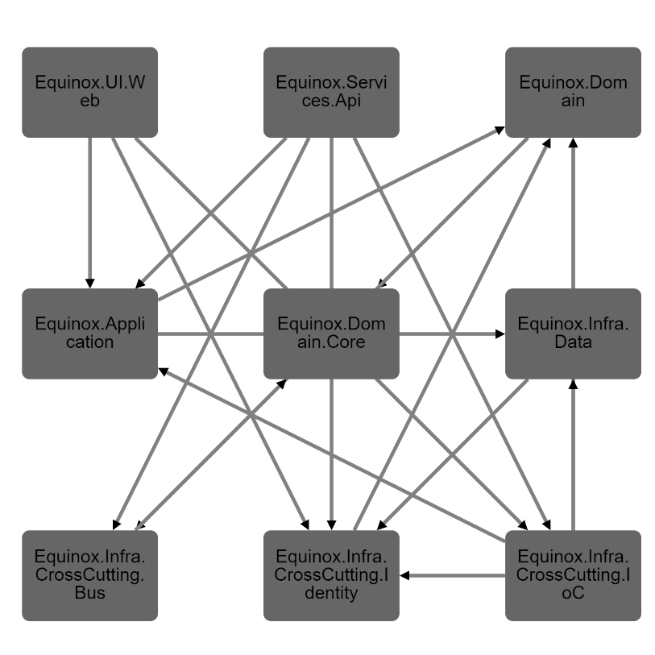

# VisualDepend

A simple extension to visualize the dependencies of your .NET Core solution or project.

## How to use?

There are two commands avaiable via the extension:

- Select Solution
- Select Project

By selecting either of these options list of available solutions or projects in current workspace directory is provided which by selecting one of them a dependecy graph of your projects is generated.